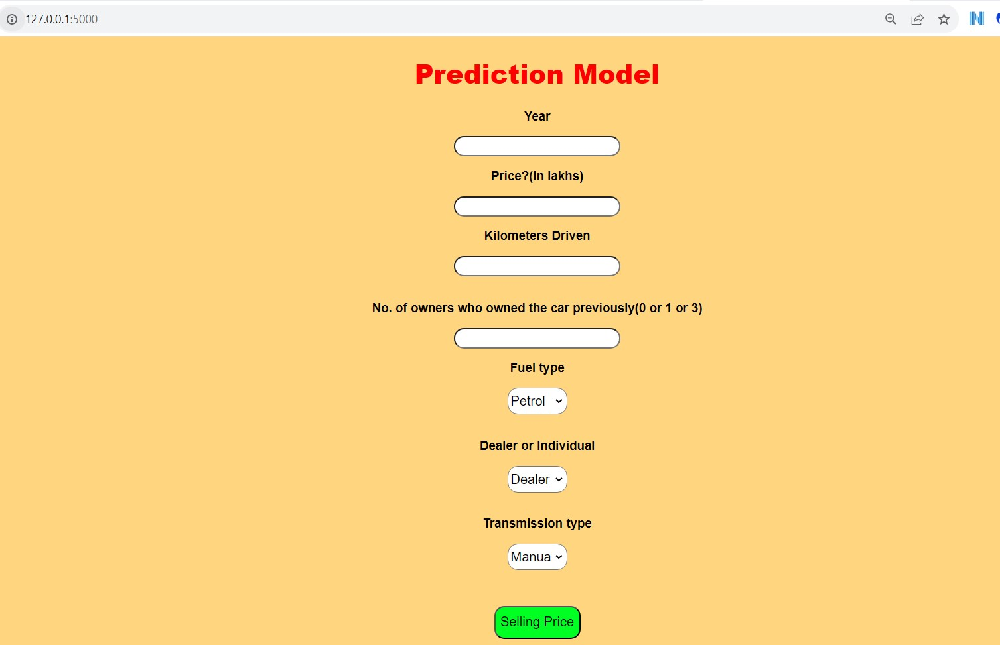

### Car-Price-Prediction

In this repository, I have prepared a Machine Learning Model which predicts the price of cars and lately have deployed the model.

### 🟢 For Model Building, please refer to: Car_Price_Prediction.ipynb
### 🟢 For Model Deployment, please refer to app.py

### 🔵 Creating the flask API
```
app = Flask("__name__")
```

The Home method calls our index.html.
```
@app.route('/',methods=['GET'])
def Home():
    return render_template('index.html')
```

The predict method is our POST method, which is basically called when we pass all the inputs from our front end and click Selling Price.
```
@app.route("/predict", methods=['POST'])
def predict():
```

The run() method of Flask class runs the application on the local development server.
```
app.run(debug=True)
```

Our model is ready, now lets test.

Go to Anaconda Prompt, and run the below query.
```
python app.py
```


Below message in Python shell is seen, which indicates that our App is now hosted at http://127.0.0.1:5000/ or localhost:5000
```
* Running on http://127.0.0.1:5000/ (Press CTRL+C to quit)
```


HERE'S HOW OUR FRONTEND LOOKS LIKE:

